1.- BUSINESS UNDERSTANDING .
Using data mining tools I will be able to estimate  among 1003 customers which ones are  likely to buy a home insurance and which ones are not , based on 85 predictor variables that will be meaningful to take a right decision. Furthermore, I will be able to perform a Decision Cost/Benefit Analysis.  Firstly ,  I audited  the TRAINING DATA SET  of 8819 records to confirm that in fact there are 8819 records  and that they can be analyzed.

1.1.-The Data audit node gives me a general  vision about how my data behaves. For example : the home_insurance variable has more 0s than 1s , this tells me that most of the people rejected the home_insurance policy. We look this behavior in Figure 1.1

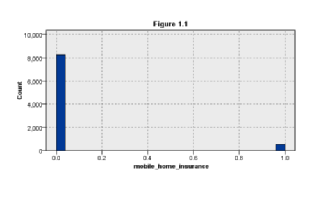

ANALYSIS TRAINING DATA SET:  After analyzing the whole data set  I found out that there are not blanks and no missing values.

2 .- DATA UNDERSTANDING.
2.1.-Firstly,  using the statistics node I analyze the 85 predictor variables to find out the pearson  correlations  .Secondly  using the regression node I analyzed the first 43 predictor  variables which correspond to the same zip code  . Thirdly, I analyzed the predictor  variables from 44 to 85 using the regression node as well. Furthermore, using the CART algorithm  I analyzed the whole 85 variables. After analyzing each of the methods I decided to pick the best 5 variables from CART model. Table 2.1 shows this characteristic.

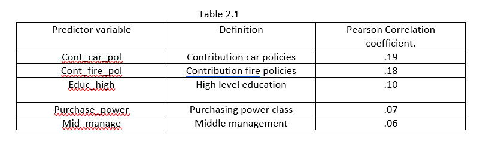

As we can see on Figure 2.1  :    “Cont_car_pol”   ( contribution car policies )  has the highest predictor importance nevertheless the other  predictors have a considerable importance as well. 

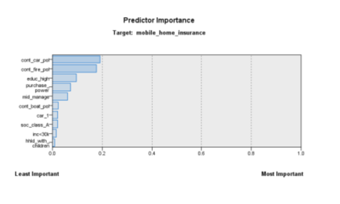 

2.2.-Among  the  predictor variables ,   I found that the subtype variable (customer subtype) has 41 segmentation categories which give some interesting  information  as we can see  on figure 2.2.1 
Main categories:
1st  Category: Lower class large families:  14.17% (1250)
2nd Category: Traditional  families:  5.89% (519)
3rd Category: Middle class families: 5.67 % (500)

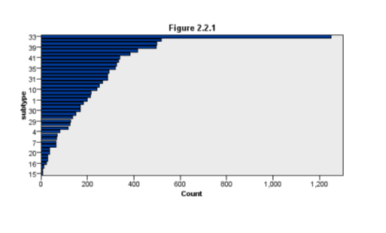 

Conclusion:  This analysis  tell me that most of the customers  in the Data Training set belong to large families that are middle-lower traditional families but families represent the principal customers  of the data set.

2.3.- To emphasize the above conclusion and using the distribution node  I analyzed the  cust_type  variable (customer main type)  and gives me the some other good information about families as main customers. Figure 2.3.1 .  This variable has 10 segmentation categories and I chose the 3 most important :
1st Category: Family with grown ups: 27.3% : 2408
2nd Category: Average family: 15.24%: 1344
3rd Category: Conservative families : 11.51%: 1015

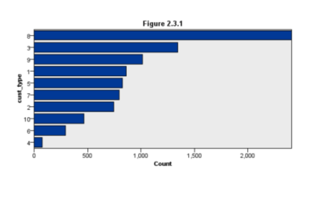

    I concluded that indeed  the main customers   for a mobile home insurance would be  families with  grown ups: average families and conservatives which share very similar characteristics as point 2.2. I assume  that the main customers would be traditional U.S families with an average income to buy a car policy. However, further analysis will be performed.

    3.-DATA PREPARATION
3.1.-I decided  to create new derived variables from  my data set  variables that I picked after analysis because I consider them as important as the five I chose to be the best predictors .However,  I will see how my new variables behave in order to have another  point of view.

3.1.1.- The first created variable is the sum of the subtype + cust_type  which I name it as sum_subtype_custype  in my derive node. After analyzing this with the statistics node it gives me an absolute correlation coefficient of .056 which has a strong correlation. This tells me that both variables have good correlation with mobil_home_insurance , however they are not in the   top 5 list.

Figure 3.1.1.1 shows  the association between the the mobile_home_insurance variable vs sum_subtype_custype  variable.

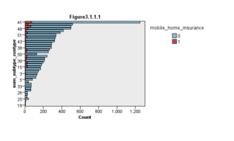

3.1.2 The second created variable is the sum of social class A +social class B1+social class C+ social class D which all of them  independently have a strong correlation coefficient .However,  I did not included them in the top 5 predictor variables. After analyzing the variable sum_A_B1_C_D    with the statistics node I obtained a correlation coefficient of .004 which is weak. Therefore, I concluded  that this new variable will not be useful but it was good to have a look about how this behaves. Figure  3.1.2.1 shows the association between the mobile_home_insurance  vs  sum_A_B1_C_D .

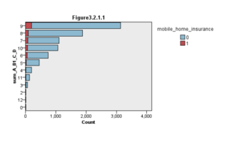

3.1.3 The third created variable is the sum of  educ_high+educ_med+educ_low  which all of them independently have a strong correlation coefficient .After analysis I had a  medium correlation coefficient  of  .018 which I consider will not be good for futher analysis.Figure 3.1.3.1 shows the association between the mobile_home_insurance vs  sum_educhigh_med_low.

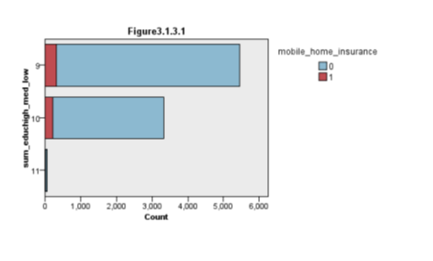 

3.1.4 The fourth created variable is the sum of  inc <30K +inc 30-45K  and after analysis with the statistics node I obtained  a strong correlation coefficient of  .074 absolute value. I  assume that this new variable “sum 30_30-45” has some important data embedded . I would say that families with an income above 30K represent  a good data set. However  I will not  consider this new variable for further analysis because  inc 30-45 variable  has  a weak  pearson correlation coefficient .Figure 3.1.4.1 shows the association between mobile_home_insurance  vs   sum 30_30-45.

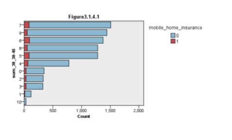 

3.1.5 The fifth created variable is the sum of  cont_third_party_ins+cont_car_pol +#_car_pol . After analyzing my new created variable I had a strong correlation coefficient of .152 which is one of my highest of my new derived variables. Figure 3.1.5.1 shows the association between  mobile_home_insurance  vs  sum_ contthird_contcarpol_Nocarpol. 

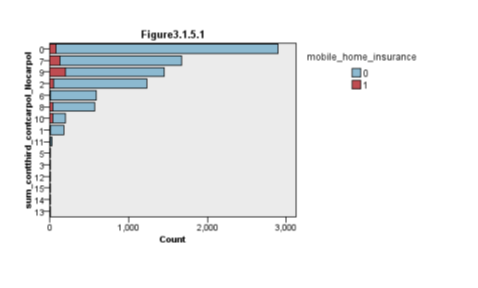

3.1.6 The sixth created variable is the sum of ave_inc+purchase_power  .After analysis I had a strong correlation coefficient  of .105 which I consider is good .Figure 3.1.6.1 shows the association between mobile_home_insurance vs  sum_aveinc_purchasepwr.

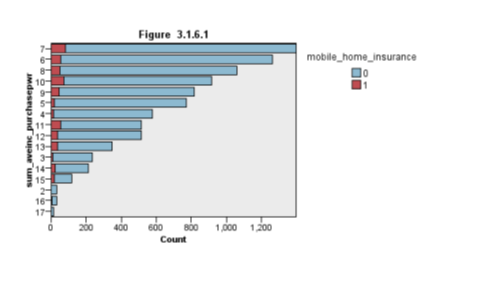

FINAL CONLUSION ABOUT NEW CREATED VARIABLES:
After analyzing all of these created variables I concluded that I will not use any of these created variables for further analysis instead I will use my top 5 variables from the list.  The reason  I will not use them  is because  I do not see a very strong correlation coefficient. However,  they are associated with the target variable  as it is depicted  in each figure above .  Further analysis has to be completed.

4.1.-Partition the data set into a training data  and  test data set.
4.1.1.- First partition: Using the partition node I partitioned the data training set  in 50% test and 50 % training. Figure 4.1.1.1 shows the data distribution.
Second Partition : I partitioned the the training data set in 70% test and 30% training. Figure 4.1.1.2. shows the distribution.

Results:  After comparing each partition  I decided to use the 50%-50%  because it has a higher correlation coefficient:  .271  and the distribution of data is better.
                                                                   Figure  4.1.1.1

                                                                   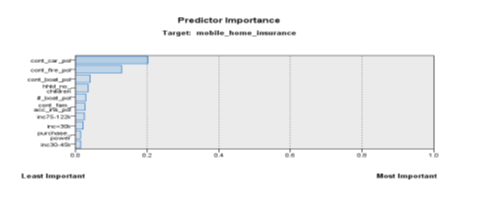

                                                                    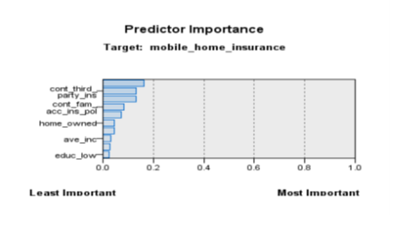 

4.2.-“ Predict Nobody” vs   “ Predict Everybody”
4.2.1.-The following  table(4.2.1.1) shows the relation between the “ Predict nobody”  vs “ Predict Everybody”   using the full mobile home training data set  where:
TN: True Negative ,TP: True Positive ,FN: False Negative .FP: False Positive

                                                                    
                                                                   

